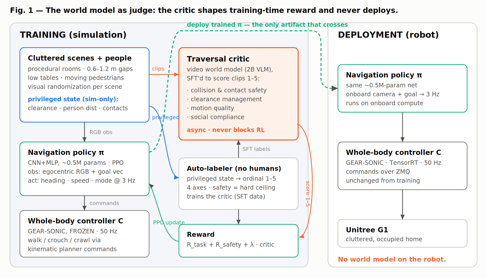

# Do Video-Language Models Make Good Traversal Judges?

**Privileged-to-visual reward distillation for humanoid navigation — a controlled study.**

> We fine-tune a compact (2B) video-language model into a **traversal judge** for humanoid
> navigation clips, and run the three controls VLM-reward papers usually skip: the
> **privileged teacher** that made the labels (as its own reward arm), a **ridge probe on the
> judge's own frozen vision tower**, and a **preregistered 3-seed × 3-arm policy test** under
> MuJoCo contact physics. The judge is training-time only — it never deploys.

🌐 **[Project page](https://linjiw.github.io/traversal-critic/)** ·
📄 **[Current draft](paper/draft.md)** ·
🗄️ **[Historical PDF (Aug 7, pre-v5)](paper/draft.pdf)**

## Findings so far (clean v5 reproduction, evidence-gated)

| What | Result |
|---|---|
| Data | 2,000 audited contact-physics rollouts, 500 procedural scenes, deterministic four-axis rubric, scene-disjoint 1,568/432 split, zero human annotations |
| Fine-tuned 2B critic | r = 0.565 on 432 held-out clips (only checkpoint with zero invalid outputs); later checkpoints reach r = 0.705 but emit 1–2 invalid digits |
| Frozen-tower ridge probe | **r = 0.705** on the same validation set — no autoregressive tuning at all |
| Domain shift (42 real + cross-sim clips) | Critic stays in [1,5] but misorders impaired gait; probe restores ordering but leaves the range — each readout fails a different criterion; corpus has no adverse events, so no transfer claim |
| Policy test | 3 seeds × {hand-crafted, privileged, critic} × 300,032 PPO steps under contact physics — **running; no policy-benefit claim yet** |

**The diagnosis so far:** the traversal signal survives the frozen vision tower;
the generative digit interface is where quality is lost.

Earlier development results (v1–v4 critics, kinematic policy pilots, single-seed physics
pilots) are preserved as history in the paper's appendix and support **no** claims.

## What this repo is

The public project page and paper draft. The research codebase (simulator harness,
labeler, SFT recipes, PPO trainer, audit chain) will be released with the paper.

## Acknowledgments

Built on [Cosmos3](https://github.com/nvidia-cosmos/cosmos-framework) (video-language
model) and [GEAR-SONIC / GR00T-WholeBodyControl](https://github.com/NVlabs/GR00T-WholeBodyControl)
(whole-body control). Real-robot footage is from the GEAR-SONIC release media.

Target venue: ICRA 2027 (RA-L/ICLR fallback). Draft claims are evidence-gated: the
policy-comparison sections stay claim-free until the preregistered matrix and held-out
analyses close.
