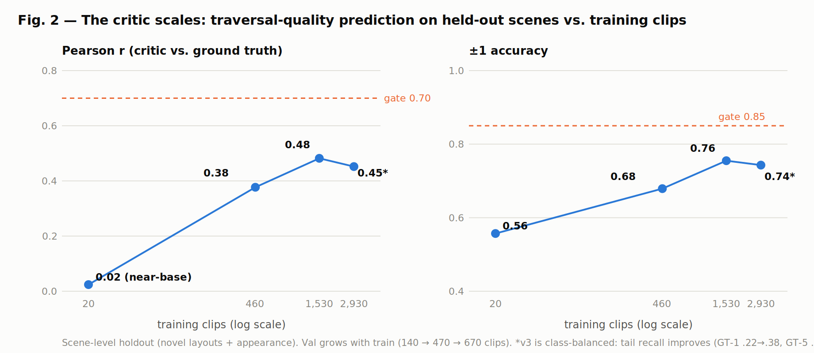

# The World Model as Judge

**Learned traversal rewards for humanoid navigation in cluttered, occupied indoor spaces.**

> We turn a video world model into a **judge** — not a simulator, not a policy — and use it
> as the reward model for training humanoid navigation in cluttered, occupied indoor spaces.

🌐 **[Project page](https://linjiw.github.io/traversal-critic/)** ·
📄 **[Draft paper (PDF)](paper/draft.pdf)** ·
🗒️ **[Pitch kit](paper/pitch.md)**

## The idea

Humanoids can walk — but they can't cross a cluttered living room with people in it,
because nobody can *write down the reward* for "squeeze through that gap politely, duck
under the table, don't crowd the person." We fine-tune a compact (2B) video-language world
model (Cosmos3-Edge) into a **traversal critic** that scores rollout clips 1–5 on collision
safety, clearance, motion quality, and social compliance — supervised entirely by privileged
simulator state (no human labels) — and use it as reward shaping for a small vision policy
over a frozen GEAR-SONIC whole-body controller. The world model **never deploys**.

## Results so far

| claim | number |
|---|---|
| Base model has no signal | Pearson **0.02** zero-shot |
| Fine-tuning extracts signal from pixels | **0.38** @ 460 clips → **0.48** @ 1,530 clips (held-out scenes) |
| Balancing fixes the rare scores | GT-1/GT-5 recall roughly **doubles** |
| **It transfers to real robot video** | 42 real G1 clips: 0 parse failures, all in the correct band |
| Hand-crafted rewards fail measurably | baseline PPO: held-out success 0.15, collisions ~every episode |

## Repository layout

This repo hosts the project page and paper. The full implementation (rollout generator,
auto-labeler, critic SFT recipes, eval sweeps, PPO trainer, async scorer daemon) lives on
the `feat/traversal-critic` branch of our cosmos-framework fork — see the paper's
reproducibility section.

## Acknowledgments

Built on [Cosmos3](https://github.com/nvidia-cosmos/cosmos-framework) (world model) and
[GEAR-SONIC / GR00T-WholeBodyControl](https://github.com/NVlabs/GR00T-WholeBodyControl)
(whole-body control). Real-robot footage in Fig. 6 is from the GEAR-SONIC release media.
